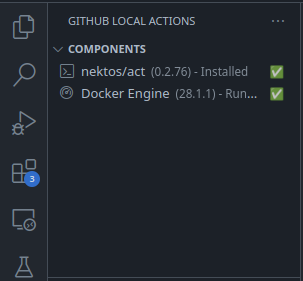
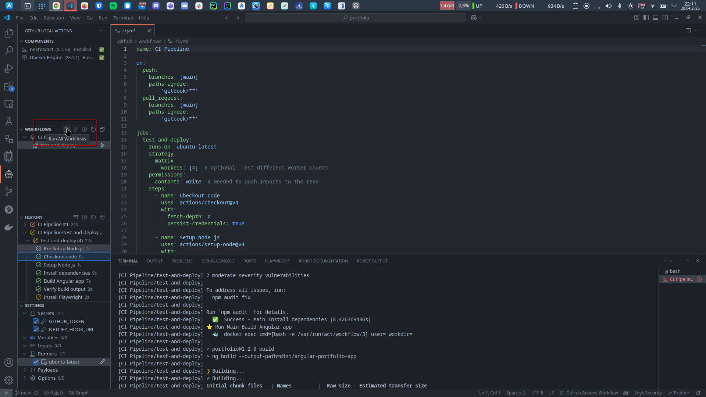
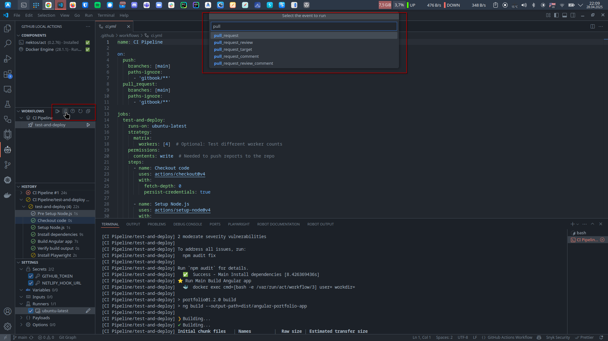
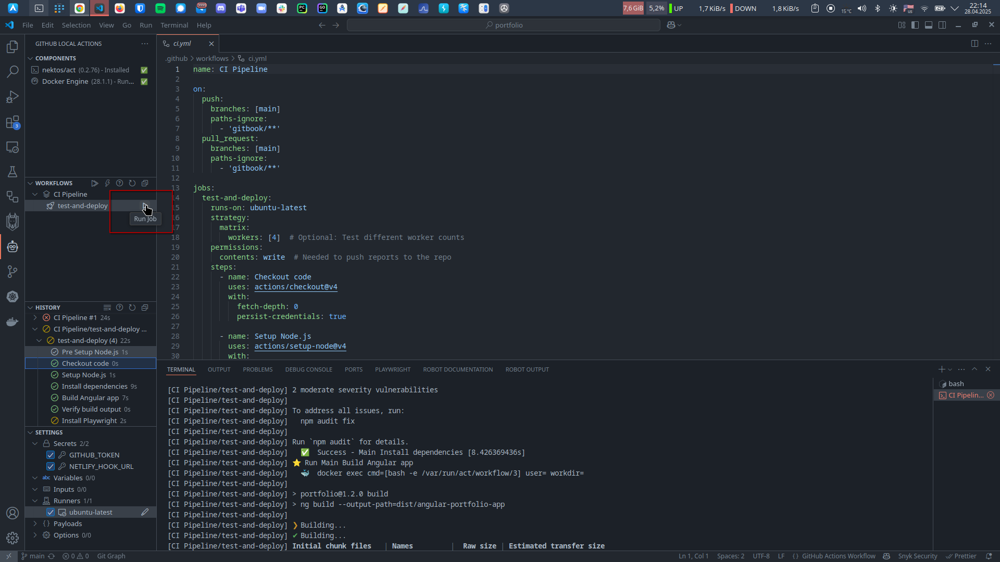
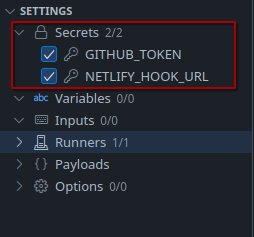
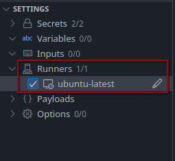
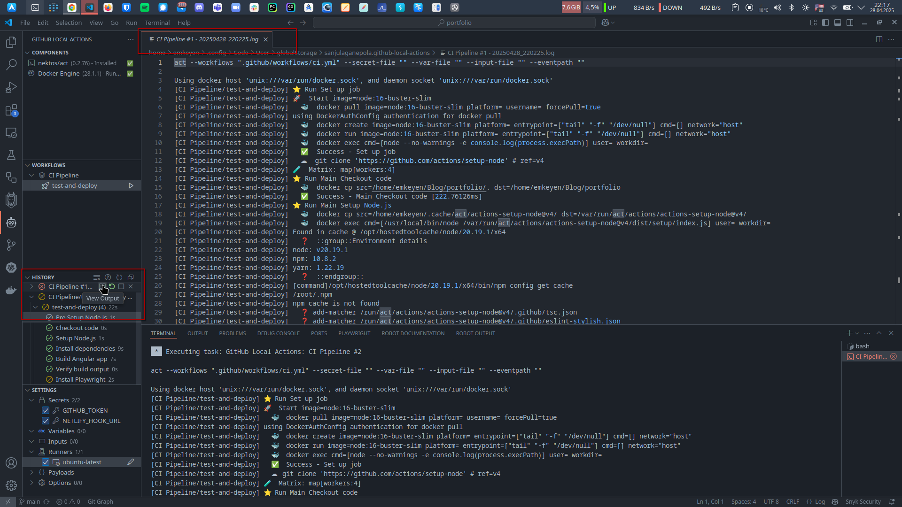

# Run GitHub Actions Locally with the GitHub Local Actions Extension for VS Code

Testing your GitHub workflows no longer needs to involve endless commit and push cycles. With the **GitHub Local Actions** extension for Visual Studio Code, you can run your workflows right from your editor, powered by the `nektos/act` CLI.&#x20;

### 🚀 Key Features:

* **Execute Workflows and Jobs:** Easily run full workflows or individual jobs directly within VS Code.
* **Simulate GitHub Events:** Trigger common GitHub events to initiate multiple workflows at once.
* **Track Workflow History:** Review previous workflow runs and logs for easier troubleshooting.
* **Customize Execution:** Configure secrets, variables, inputs, runners, event payloads, and execution settings to fit your local environment.

### Why Run GitHub Actions Locally?

Running GitHub Actions locally offers major advantages, as highlighted by the `nektos/act` documentation:

* **⏳ Instant Feedback:** Developers, especially those new to GitHub Actions, often push numerous test commits just to validate changes to workflow files. Running workflows locally eliminates this repetitive cycle, allowing much faster iteration and learning.
* **🛠️ Consistent Local Automation:** By executing the same workflows you would run on GitHub, directly on your machine, you can automate tasks, maintain environment consistency, and accelerate your overall development workflow.

***

## Install GitHub Local Actions VSC Extension

Launch VS Code Quick Open (`Ctrl+P`), paste the following command, and press enter.

```bash
ext install SanjulaGanepola.github-local-actions
```

***

## Component Installation <a href="#component-installation" id="component-installation"></a>

### 1. nektos/act <a href="#component-installation" id="component-installation"></a>

Install for Arch Linux

```bash
pacman -Syu act
```

or

```bash
curl https://raw.githubusercontent.com/nektos/act/master/install.sh | sudo bash
```

Install for macOS/Linux

```bash
brew install act
```

for installation on other platforms like Windows check documentation from Links section below

### 2. Docker Engine

To pull Docker images and run Docker containers, you need the Docker Engine. The Docker Engine includes a daemon to manage the containers, as well as the `docker` CLI frontend.



#### Starting Docker Engine <a href="#starting-docker-engine" id="starting-docker-engine"></a>

Before running any workflows, you should ensure the `Docker Engine` appears as `Running` in the `Components` view. If it is `Not Running`, you can use the `Start` action to launch Docker Desktop for Windows and MacOS. For Linux, a VS Code task will be launched to start the docker daemon using the command:

```bash
systemctl start docker
```

<figure><figcaption><p>Succesfully installed components</p></figcaption></figure>


***

## Workflows <a href="#run-single-workflow" id="run-single-workflow"></a>

### Run Single Workflow <a href="#run-single-workflow" id="run-single-workflow"></a>

If you would like to run just a single workflow, locate the workflow in the `Workflows` view and use the `Run Workflow` action. This action behaves similar to the previous one, except it will only start a VS Code task and create a history entry for the selected workflow.

<figure><figcaption></figcaption></figure>

### Run All Workflows <a href="#run-all-workflows" id="run-all-workflows"></a>

To simply run all workflows in the workspace, use the `Run All Workflows` action on the `Workflows` view. This will start up individual VS Code tasks for each workflow defined in your `.github/workflows` folder and create separate entries in the History view.

<figure><figcaption></figcaption></figure>

### Run Event <a href="#run-event" id="run-event"></a>

GitHub events are used to configure workflows to run when specific activities happen on GitHub. These same events can be simulated to run multiple workflows locally. To run an event, use the `Run Event` action on the `Workflows` view which will prompt you for the event to trigger. Individual VS Code tasks will be started and history entries will be created for each workflow in the workspace that is set to be triggered by that event.

<figure><figcaption></figcaption></figure>

### Run Job <a href="#run-job" id="run-job"></a>

To run a specific job in a workflow, expand the workflow with the desired job in the `Workflows` view and use the `Run Job` action. This action will also only create a single VS Code task and one history entry for the executing job.

<figure><figcaption></figcaption></figure>

***

## Settings

### Secrets

Secrets of the format `${{ secrets.mySecret }}` are extracted from all workflow files and shown in the `Settings` view. These secrets can be assigned a value using the _Edit_ action and the values visibility can be toggled using the `Show`/`Hide` action. After assigning a value, it must also be checked so that it can be used during execution.

<figure><figcaption></figcaption></figure>

Example `.secrets` file:

```
export mySecret='my-secret-value'
PRIVATE_KEY="---...\nrandom text\n...---"
JSON="{\n\"name\": \"value\"\n}"
SOME_SECRET=SOME_SECRET_VALUE
```



***

### Variables

Variables of the format `${{ secrets.myVariable }}` are extracted from all workflow files and shown in the `Settings` view. These variables can be assigned a value using the _Edit_ action just like secrets and must be checked for it to be used during execution. During execution, act will include them using the `--var` option which specifies the value for a variable (ie. `--var myVariable=myValue`).

If you have matching repository or environment variables defined in GitHub and would like to use the same values locally, you can use the `Import from GitHub` action to authenticate and load these values into the `Settings` view. You must ensure your GitHub account has the adequate authority to access these variables to use this action.

Similar to the secrets file, an alternative is to use the `Create Variable File` action to create a file for storing variable values (default file name is `.vars`). This file should also use the Ruby’s gem [dotenv](https://github.com/bkeepers/dotenv) format as act uses the [godotenv](https://github.com/joho/godotenv) library to parse these types of files too.

Example `.vars` file:

```
export myVariable='my-variable-value'
JSON="{\n\"name\": \"value\"\n}"
SOME_VARIABLE=SOME_VARIABLE_VALUE
```

Although you can also use the `Locate Variable Files` to load in multiple existing files just like you can with secrets, you can only select one to be used for execution. Upon selecting one and running a GitHub Action, act will include it using the `--var-file` option which specifies the path to the variable file.



***

### Runners

When running workflows in GitHub, [virtual environments](https://docs.github.com/en/actions/using-github-hosted-runners/using-github-hosted-runners/about-github-hosted-runners) are used. For `act` to run workflows locally, it must run a container for the runner defined in your workflow file. There are several [default images](https://nektosact.com/usage/runners.html#runners) which act uses for this based on runner type and size.

<figure><figcaption></figcaption></figure>

The `Edit` action can be used in the `Settings` view to specify a different image for a runner. This will use the `--platform` option which specifies a custom image to use per platform (ie. `--platform <platform>=<docker-image>`).&#x20;



***

### Inputs

Read more here



***

### Payloads

Read more here



***

## History

### History Output Logs

The history output for all entries are stored in log files on disk. These files are located in a folder allocated for the extension in VS Code’s global storage directory. Use the `View Output` action on any history entry to easily access any of these logs.

<figure><figcaption></figcaption></figure>

The history status of a workflow, job, and step can be used to understand whether a workflow passed or where it went wrong.

### History Status

The history status of a workflow, job, and step can be used to understand whether a workflow passed or where it went wrong.

| Success                                                                                                                                                               | Failure                                                                                                                                                                  | Cancelled                                                                                                                                                                         | Skipped                                                                                                                                                                  | Unknown                                                                                                                                                                     |
| --------------------------------------------------------------------------------------------------------------------------------------------------------------------- | ------------------------------------------------------------------------------------------------------------------------------------------------------------------------ | --------------------------------------------------------------------------------------------------------------------------------------------------------------------------------- | ------------------------------------------------------------------------------------------------------------------------------------------------------------------------ | --------------------------------------------------------------------------------------------------------------------------------------------------------------------------- |
| <div align="center"></div> | <div align="center"></div> | <div align="center"></div> | <div align="center"></div> | <div align="center"></div> |

***

## Links










